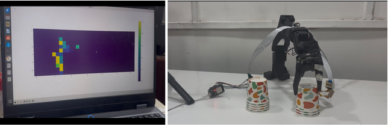
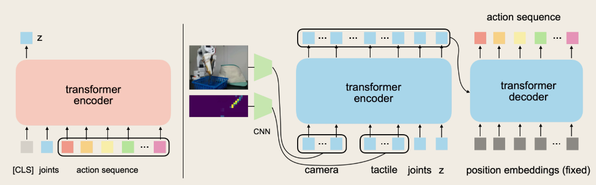
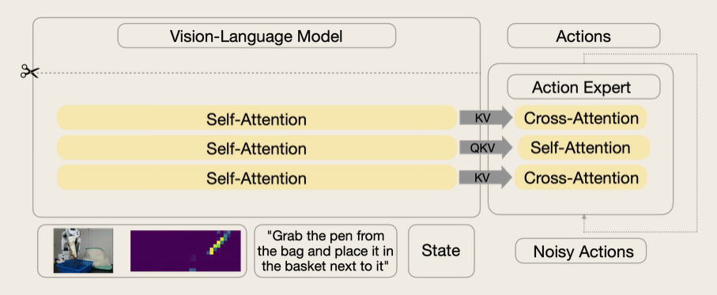
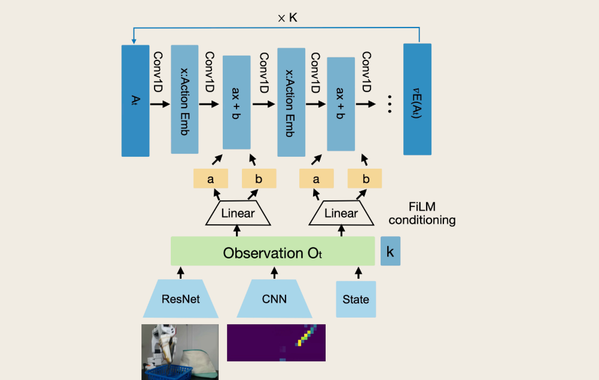
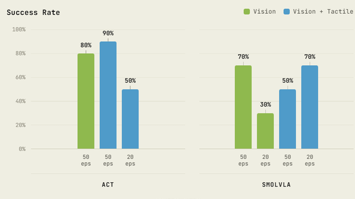
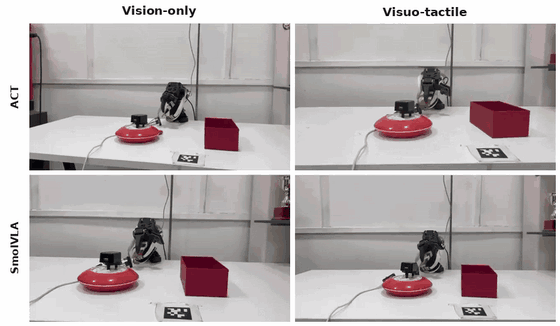

# Beyond Vision: Giving Robots a Sense of Touch

*Mission Mimosa · Visuo-tactile manipulation with FlexiTac · by Aryan Kakad & Mahi Zade*

## Introduction

Most robotic manipulation systems today rely almost entirely on vision and kinematics. While this works for rigid tasks, closed-loop control hits a wall when a robot actually needs to grasp, slip, or adjust to an object dynamically. Without tactile feedback, the system is essentially numb.

**Mission Mimosa** bridges this gap by building a robust framework for visuo-tactile manipulation.

Through this project, we are integrating custom high-resolution tactile sensors — specifically the **FlexiTac arrays** — directly into robotic end-effectors. Rather than relying on vision alone, we capture continuous pressure data across a 512-taxel grid during teleoperation. This tactile data is synchronized with RGB camera feeds and processed through convolutional encoders to extract dense spatial pressure features.

To make the robot truly contact-aware, we fuse these distinct visual and tactile signals using **bidirectional cross-attention mechanisms**. The camera tells the touch signal what the robot is holding, and the touch signal tells the camera exactly where and how hard the contact is.

This unified visuo-tactile data then serves as the conditioning input for advanced action generation architectures, including **Diffusion**, **ACT**, and **SmolVLA**.

## FlexiTac: Sensing Through Flexible Circuits

FlexiTac is a low-cost, three-layer (FPC–Velostat–FPC) tactile sensor based on the principle of **piezoresistance**. It consists of a readout board made of simple electronic components communicating with the host PC at 100 Hz.

It consists of two FPCs with vertical and horizontal alignment of electrodes each. Velostat — a piezoresistive material — is sandwiched between these two FPCs, resulting in a 16×32 matrix whose elements are known as **taxels**. When pressure is applied to the sensor, the Velostat's resistance changes at the point of contact. Each of the 512 taxels is mapped to its (row, column) position in the matrix, so every taxel holds its own pressure value. However, the current FlexiTac supports a 12×32 matrix. Together, these values form a complete pressure image known as the **heatmap**.

The heatmap converts the 12×32 tactile array of raw taxels into a 2D pressure image. Each taxel is displayed at its position in the tactile array, and the colour gradient shows how hard that particular region is pressed. The footprint of any object appears as a 2D image on the visualizer, so you can predict the shape and size of the grasped object. The mapping keeps updating in real time, letting you track changing contacts live.

### Mechanical Response

When the sensor is pressed, the applied force is distributed across individual taxels. For a taxel at row $i$ and column $j$, the resulting pressure depends on how much force is applied and the area over which it acts:

$$P_{ij} = \frac{F_{ij}}{A_{ij}}$$

where $P_{ij}$ is the resulting pressure, $F_{ij}$ is the applied normal force, and $A_{ij}$ is the effective contact area of the taxel.

This pressure changes the microscopic contact between the conductive material and the electrode. For an ideal contact, the conductance scales linearly:

$$C_x = k_x \cdot P_x$$

where $C_x$ is the contact conductance, $P_x$ the applied pressure, and $k_x$ the contact sensitivity constant. As pressure increases, conductance increases and resistance decreases, since $R = 1/C$.

However, for real FlexiTac-like sensors, contact mechanics result in a nonlinear, sublinear response:

$$C_x = k_x \cdot \left(P_x\right)^m$$

where $m$ is the nonlinearity exponent. For real sensors, $m \lt 1$ at lower loads, causing the response to curve rather than remain perfectly linear.

### Electrical Readout

The total electrical resistance of a single taxel is modeled as multiple paths working together:

$$R_{\text{taxel}} = R_{\text{in}} + R_{\text{out}} + R_{\text{gap}}$$

where $R_{\text{gap}}$ is the internal resistance of the conductive piezoresistive material bridging the gap between the electrodes.

This physical resistance is read by an external circuit and converted into a readable voltage:

$$V_{\text{out}} = \frac{R_{\text{gain}}}{R_{\text{taxel}}} \cdot V_{\text{bias}}$$

For a full 12×32 FlexiTac array, a microcontroller's ADC digitizes this output for every taxel:

$$V_{ij} = \frac{D_{ij}}{D_{\max}} \cdot V_{\text{ref}}$$

where $D_{ij}$ is the raw ADC reading, $D_{\max}$ the ADC's maximum digital value, and $V_{\text{ref}}$ the reference voltage used to convert the reading into an actual voltage.

This electrical reading is then converted into an estimated force using:

$$F_{ij} = \left( \frac{V_{ij}}{K} \right)^{1/m}$$

### Tactile Data Representation

For representing pressure as a heatmap, the matrix is normalized to the range $[0, 1]$:

$$H_{ij} = \mathrm{clip}\left( \frac{F_{ij} - F_{\min}}{F_{\max} - F_{\min}}, \; 0, \; 1 \right)$$

where $H_{ij}$ is the normalized heatmap value, and $F_{\min}/F_{\max}$ are the minimum and maximum expected force values.

These normalized values are then mapped to colour by a colormap to create the heatmap gradient:

$$\mathrm{RGB}_{ij} = \mathcal{C}(H_{ij})$$

## Integrating Tactile Sensing into Manipulation Policies

### ACT

To use tactile data for robot learning, the robot combines it with visual and joint-position information. Since ACT cannot directly process the 2D heatmap, a **Tactile Encoder** (CNN or MLP) converts it into a compact feature representation that ACT can use:

$$T_{\text{tactile}} = \mathrm{Encoder}_{\text{tactile}}(H)$$

where $T_{\text{tactile}}$ are the tactile tokens that represent the extracted tactile information.

Finally, the robot combines these tactile tokens with its other sensor data into a single flat sequence. This multimodal sequence is what gets fed into the Transformer policy to predict the robot's next movements:

$$X_{\text{input}} = \left[ z,\; T_{\text{state}},\; T_{\text{tactile}}^{1 \dots N},\; T_{\text{img}}^{1 \dots M} \right]$$

where $X_{\text{input}}$ is the combined multimodal sequence, $T_{\text{img}}$ the image feature token, $T_{\text{state}}$ the proprioceptive token, and $z$ the latent token representing variation during training.

### SmolVLA

#### Phase 1: Integrating the Senses

Before a robot can move, it must translate physical sensations into a mathematical language the Vision-Language Model (VLM) understands.

**Tactile Encoding & Projection.** The 2D pressure heatmaps from the robot's fingers are flattened into sequence tokens, then linearly projected to match the network's exact hidden dimension size:

$$Z_{\text{tactile}} = f_{\text{enc}}(T)$$

$$E_{\text{tactile}} = Z_{\text{tactile}} W_{\text{proj}} + b_{\text{proj}}$$

where $T$ is the raw tactile heatmap tensor, $f_{\text{enc}}$ the encoder (like a CNN) that turns the map into tokens, and $E_{\text{tactile}}$ the final embedded sequence, dimensionally aligned for the VLM.

**Assembling the Multimodal Context.** Touch is useless without context. The model concatenates the embeddings for vision, language instructions, touch, and the robot's joint states into a single "prefix" sequence:

$$C = \left[ E_{\text{img}} \;\Vert\; E_{\text{lang}} \;\Vert\; E_{\text{tactile}} \;\Vert\; E_{\text{state}} \right]$$

where $C$ is the unified context tensor. By packing them together, the network's self-attention mechanism can cross-reference what it feels with what it sees.

#### Phase 2: Learning the Flow (Training)

To teach the robot to move, SmolVLA uses **Continuous Normalizing Flows**. It artificially destroys perfect actions with noise, then trains the network to predict the exact path (velocity) back to the clean action.

**Forward Noise Interpolation.** During training, the system mixes a perfect ground-truth action with pure noise at a random timestep:

$$x_t = t\,\epsilon + (1 - t)\,a$$

where $a$ is the true robot action, $\epsilon$ pure standard Gaussian noise, and $x_t$ the artificially noisy action at timestep $t$.

**Velocity Prediction (the loss function).** The model aims to predict the velocity vector $u_t$ needed to transport the clean action into noise. We train the network by measuring how far its prediction is from the truth using Mean Squared Error:

$$\mathcal{L}(\theta) = \mathbb{E}_{t,\epsilon,a}\left[ \left\| v_\theta(x_t, t, C) - u_t \right\|_2^2 \right]$$

where $v_\theta$ is the neural network trying to predict the flow, $u_t$ the true target velocity, and $C$ the multimodal context from Phase 1, acting as the guiding condition.

#### Phase 3: Deployment (Inference)

In the real world, the robot doesn't know the perfect action. It must derive the correct movement from scratch based on its current environment.

**Action Generation.** Starting with pure noise ($t = 1$), the model uses an Euler ODE solver to step backward along the vector field it learned, guided by the context $C$, until it arrives at a clean movement:

$$x_{t - \Delta t} = x_t - \Delta t \cdot v_\theta(x_t, t, C)$$

where $x_t$ is the noisy state at the current timestep, $\Delta t$ the step size for the ODE solver, and $x_{t-\Delta t}$ the progressively refined action. Once this reaches $t = 0$, the robot executes the resulting physical command.

### Diffusion Policy

To integrate touch, the tactile heatmap is first passed through a tactile encoder that converts the raw sensor readings into a compact set of feature tokens:

$$T_{\text{tactile}} = E_{\text{tactile}}(H)$$

where $H$ is the tactile heatmap and $T_{\text{tactile}}$ represents the extracted tactile information.

These tactile features are then flattened and combined with the visual and robot-state features:

$$C = \left[ E_{\text{vision}} \;\Vert\; E_{\text{state}} \;\Vert\; T_{\text{tactile}} \right]$$

This combined representation acts as the policy's multimodal observation, containing information about what the robot sees, feels, and its current state. It is passed through conditioning layers to generate parameters that modulate the action-generation network, allowing the tactile information to influence its intermediate features.

Instead of directly predicting the action trajectory, Diffusion Policy learns to **denoise** it. Noise is added to the original action $x_0$:

$$x_t = \sqrt{\bar{\alpha}_t}\, x_0 + \sqrt{1 - \bar{\alpha}_t}\,\epsilon, \qquad \epsilon \sim \mathcal{N}(0, I)$$

The policy then predicts the added noise using the noisy action, the diffusion timestep, and the multimodal conditioning:

$$\hat{\epsilon} = \epsilon_\theta(x_t, t, C)$$

Thus, the tactile tokens are not used as a separate input to the final action prediction — they are embedded into the conditioning of the action-generation network, allowing contact information from the tactile sensor to influence the actions predicted alongside vision and robot state.

## Vision vs. Visuo-tactile Policy Evaluation

Here's the contact-rich benchmark task used to compare vision-only and visuo-tactile policies.

## References

- Zhao, T. Z., Kumar, V., Levine, S., & Finn, C. (2023). *Action Chunking with Transformers*. [arXiv:2304.13705](https://arxiv.org/abs/2304.13705)
- Shukor, M., Aubakirova, D., & Capuano, F. (2025). *SmolVLA*. [arXiv:2506.01844](https://arxiv.org/abs/2506.01844)
- Chi, C., Xu, Z., Feng, S., Cousineau, E., Du, Y., Burchfiel, B., Tedrake, R., & Song, S. (2024). *Diffusion Policy: Visuomotor Policy Learning via Action Diffusion*. [arXiv:2303.04137](https://arxiv.org/abs/2303.04137)
- Huang, B., & Li, Y. (2026). [arXiv:2604.28156](https://arxiv.org/abs/2604.28156)
- FlexiTac: *Integration of tactile sensors*. [LeFlexiTac](https://tna001-ai.github.io/LeFlexiTac/index.html)
- Castellanos-Ramos, J., Navas-González, R., Fernández, I., & Vidal-Verdú, F. (2015). *Insights into the Mechanical Behaviour of a Layered Flexible Tactile Sensor*. Sensors, 15(10), 25433–25462. [doi:10.3390/s151025433](https://www.mdpi.com/1424-8220/15/10/25433)
- Project website: [Mission Mimosa](https://zademahi238.github.io/mission-mimosa/)